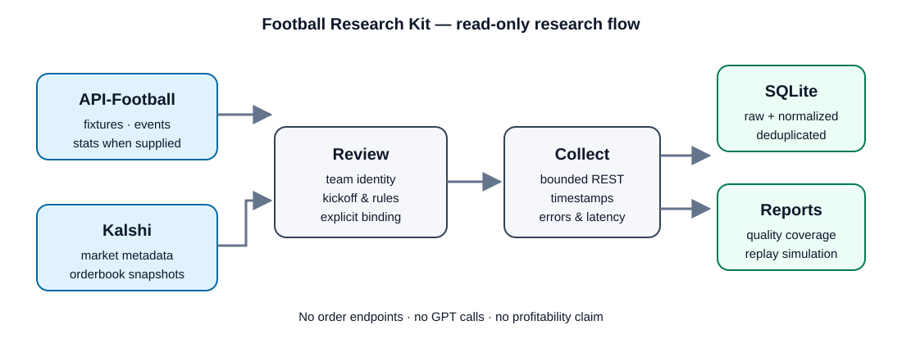

# Football Research Kit — V0.1.1 preview

Collect football fixtures and Kalshi market snapshots, inspect missing data,
and reproduce a small, explicitly simulated strategy replay.

**Local release candidate, not yet a paid general release.** Mock-provider and
synthetic acceptance tests are included. API-Football and Kalshi have been jointly
checked on one live fixture; a full-match soak and independent customer onboarding
remain required. This tool makes no trading requests and provides no profitability claim.



The diagram is intentionally high-level. The public preview does not contain the
production collectors, private mappings, account credentials, live strategies or
real historical archives.

## Quick start (macOS / Linux, Python 3.11+)

```sh
python3 -m venv .venv
source .venv/bin/activate
python -m pip install .
football-research demo --out runs/demo
```

Open `runs/demo/report.html` in a browser. The demo uses six fabricated fixtures
and requires no keys or network. It deliberately contains a win, losses,
unsettled exposure, insufficient depth, and stale observations. Repeating it in
the same directory does not duplicate records.

Alternatively, before installation: `python3 -m football_research demo`.

## What is included

- GET-only API-Football fixture/event/statistics and Kalshi market/orderbook clients.
- Discovery review file with text-ranked candidates (never automatically approved).
- Explicit per-fixture team IDs, kickoff, league, regulation scope and ticker bindings.
- Per-team statistics as supplied, complete returned event lists, raw responses,
  receipt timestamps, request latency and errors; missing values stay missing.
- SQLite WAL transactions, exact-record deduplication and single-collector lock.
- Daily gzip exports with size chunks and an authoritative archive manifest.
- Standalone HTML quality report and a frozen, fee/depth-aware example replay.

There are no GPT calls, account balance queries, portfolio queries, order paths,
or credentials bundled in this package. WebSocket capture is not included in V0.1.

## Start collecting with your own subscriptions

1. Copy `config.example.json` to `config.local.json`. Select the correct league,
   season and Kalshi GAME/TOTAL series. The example is not a promise of current
   league coverage.
2. Set `API_FOOTBALL_KEY` in your environment. Do not put keys in config or Git.
   Optional signed Kalshi requests require `pip install '.[authenticated]'`,
   `KALSHI_API_KEY_ID` and `KALSHI_PRIVATE_KEY_FILE` pointing to your local PEM.
   Some public endpoints work without authentication; a 401/403 requires checking
   your account access. Credentials are sent only to the fixed provider hosts.
3. Discover a UTC date:

```sh
football-research discover --config config.local.json --date 2026-09-07 --out runs/live
```

4. Inspect `runs/live/review-2026-09-07.json`. Compare both teams, date/time,
   women's/reserve/youth status and market rules. Suggestions may be wrong and
   are not restricted by a verified Kalshi kickoff. Choose actual tickers and
   add bindings with the `bind` command or following [the binding guide](BINDINGS.md).
5. Validate and run a bounded session:

```sh
football-research validate --config config.local.json
football-research doctor --config config.local.json --out runs/live --online
football-research collect --config config.local.json --out runs/live --cycles 10
football-research report --out runs/live --fee-rate 0.07
football-research archive --out runs/live
```

The fee coefficient is an **assumption you must verify** for the relevant market
and date. The example is not a universal fee schedule. Keep synthetic and live
runs in separate directories. Ctrl-C preserves committed SQLite records; rerun
the same command to continue. A partial fixture cycle may have raw records but
no normalized snapshot; quality/error review is necessary.

## Replay example

Frozen rule: first observed 25–29 minute 0–0 state in the first half, Over2.5 NO
ask 61–70 cents, spread at most 3 cents, enough displayed bid and ask depth for
one contract. One entry per fixture. Hold 15 minutes, then use the first eligible
book within 120 seconds. Missing/unfillable exit -> hold to official settlement;
unknown settlement stays OPEN, with cost shown separately. Buy at ask VWAP plus
1 cent, sell at bid VWAP minus 1 cent, fees rounded up per simulated order.

Orderbook ladders and market status are respected. Resting depth does not
guarantee fills. Receipt age does not measure source update latency. This is a
workflow example, not a recommended strategy or an out-of-sample edge claim.

## Operating limits

Start with 1–5 reviewed fixtures at 60-second intervals. Per active fixture/cycle:
approximately 3 API-Football calls plus 2 Kalshi calls per market; retries add
calls. Ten fixtures running all day at 60 seconds could need 43,200 football
calls/day before discovery/retries. Discovery is a separate command, not a loop.
Requests are sequential and bounded; `health` records report cycle overruns.
REST snapshots can miss between-poll extrema and rapid goals.

Bindings are deliberately manual in V0.1; automatic name approval and Telegram
are not shipped. Current source timestamps may be absent; pressure is not an
invented feature. Historical settled Kalshi markets may require a separate
historical endpoint adapter that is not part of this release.

Retention defaults to **keep history**. Exports incrementally compress only new
record IDs, group them by UTC day and kind, and commit the manifest after gzip
verification. They run every 60 cycles (configurable `archive_every_cycles`) and
at clean shutdown. Crashes retain committed SQLite data for restart/export.
SQLite is not automatically truncated. Collection pauses below 256 MiB free disk
(configurable `min_free_disk_mb`); move/archive completed runs as needed. Old
unlisted exports may remain after upgrading the original exporter. Do not glob
all archive files as one dataset; follow the manifest or use SQLite.

## Documentation & verification

- [Detailed product introduction and onboarding](GITHUB_SHOWCASE.md)
- [Field definitions](SCHEMA.md)
- [Bindings and identity review](BINDINGS.md)
- [Architecture and extraction audit](AUDIT.md)
- [Release checklist and support boundaries](RELEASE.md)
- [Dependencies and data rights](NOTICE.md)

```sh
python -m unittest discover -s tests -v
```

No third-party raw historical dataset is included. Customers must have appropriate
provider access and comply with data licenses. This repository is a public
documentation preview; it is not currently offered for sale.
